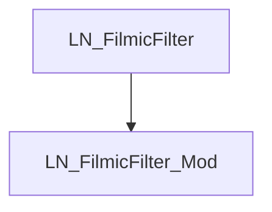

# LN_FilmicFilter_Mod

| Plugin |
|:-----------|
| [LN_FilmicFilter_Mod.js](https:// "LN_FilmicFilter_Mod.js")       |

LRIKI様(https://twitter.com/lriki8)作のオクトラプラグインを改造して 
戦闘時のぼかしON/OFF、ぼかし強度XY軸の機能を追加しました。 
ついでにぼかし品質も上げていますので綺麗なぼけ味になっています。 

本プラグインのオリジナルはLRIKI様です。 
面倒なので私の方でメンテすることは無いと思います。 
MITではありますがオリジナルの意志を尊重して難読化維持しています。 
最新版等はオリジナルをご参照ください。 
また、本プラグインもMITライセンスとします。 

使い方はLRIKI様のページを参照してください。 
https://github.com/lriki/LN_FilmicFilter/blob/main/README.md 

